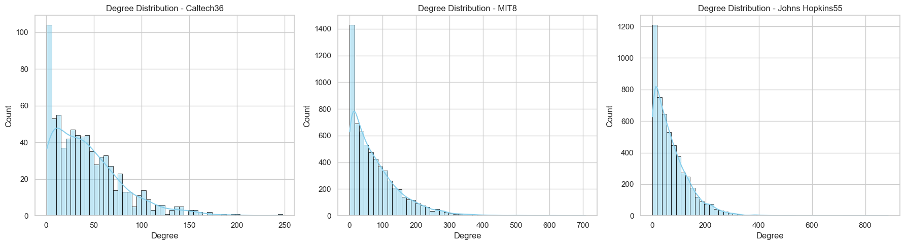

# Facebook100 Network Analysis

**What shapes friendships on a college campus — proximity, status, or pure chance?**

This project applies network science methods to the [Facebook100 dataset](https://archive.org/details/oxford-2005-facebook-data) — a snapshot of Facebook friendship graphs from 100 American universities captured in 2005, before Facebook opened to the public. Each graph contains thousands of students with attributes like dormitory, graduation year, and academic status.

We start from basic structural metrics and progressively build toward link prediction and community detection, treating each question as a step in a coherent investigation.

## What we found

### 1. Degree distributions and the small-world effect

Every campus exhibits a heavy-tailed degree distribution: most students have a few dozen friends, but a small minority are connected to hundreds. Average clustering coefficients are high (~0.2–0.3), confirming the "friends of friends are friends" pattern typical of social networks.

Caltech (769 nodes) behaves like a village — high density, tight clusters. MIT (6,440 nodes) behaves like a city — sparser, but with more structural diversity.

<p align="center"></p>

### 2. The popularity paradox

A clear negative correlation between degree (number of friends) and local clustering coefficient: the more connected a student is, the less cohesive their friend group. Popular students bridge multiple communities rather than belonging to one tight circle.

<p align="center"></p>

### 3. Assortativity — who connects with whom

We computed assortativity coefficients across all 100 universities for each attribute:

| Attribute | Avg. assortativity | Interpretation |
|---|---|---|
| **Status** (undergrad/grad/faculty) | ~0.32 | Strongest barrier — people stay within their tier |
| **Dormitory** | ~0.18 | Physical proximity drives connections |
| **Graduation year** | ~0.15 | Cohort effects, but weaker than expected |
| **Degree** (structural) | ~0.08 | Weak — popular students don't preferentially connect |

The result: **institutional hierarchy matters more than shared interests** for predicting who befriends whom.

<p align="center"></p>

### 4. Link prediction

We benchmarked four link prediction algorithms (Jaccard, Adamic-Adar, Common Neighbors, Preferential Attachment) across 10 university graphs using Precision@K. Adamic-Adar consistently outperforms the others — weighting shared neighbors by their rarity captures the social signal better than raw counts.

<p align="center"></p>

### 5. Label propagation

We implemented the label propagation algorithm (Bhagat et al.) to predict missing node attributes from network structure alone. Dormitory labels propagate well (accuracy ~0.4–0.6 depending on the campus), while graduation year is harder to recover purely from topology.

### 6. Community detection

Louvain and Girvan-Newman community detection algorithms were compared against ground-truth attributes using the Adjusted Rand Index. Detected communities align best with dormitory assignments — suggesting that residential proximity, not academic programs, is the primary organizing principle of campus social life.

## Project structure

```
├── notebooks/
│   └── analysis.ipynb        ← Full analysis (load → metrics → prediction → communities)
├── data/
│   └── facebook100/          ← 100 university graphs (.mat format)
├── assets/                   ← Generated figures
├── Project_Network_Science_Pierre_CHAMBET_Lilian_MARTHIENS.pdf  ← Report
├── LICENSE
└── README.md
```

## Tech stack

Python 3 · NetworkX · scikit-learn · NumPy · pandas · SciPy · Matplotlib · Seaborn

## Authors

Pierre Chambet & Lilian Marthiens — Télécom SudParis, 2026.

## License

MIT
